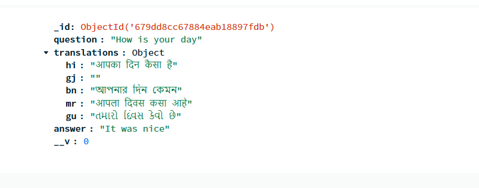

# **FAQ Management System with Multilingual Support and Caching**

This project is a **FAQ management system** built with **Node.js**, **MongoDB**, **Redis**, and integrates **Google Translate API** for multilingual translation. It provides an **admin panel** for managing FAQs and utilizes **Redis** for caching data, improving performance.
Demo video with basic frotend
[Watch the video](assets/video/FAQ%20Admin%20Panel%20-%20Google%20Chrome%202025-02-01%2016-42-53.mp4)

---

## **Table of Contents**

1. Installation Steps
2. API Usage Examples
3. How I Implemented This Project
4. Libraries and APIs Used

---

## **Installation Steps**

Follow these steps to set up the FAQ management system:

1. **Clone the Repository:**
    ```bash
    git clone https://github.com/yashitz07/FAQs.git
    cd FAQs
    ```

2. **Install Dependencies:**
    Ensure you have **Node.js** and **npm** installed, then run:
    ```bash
    npm install
    ```

3. **Set Up Environment Variables:**
    Create a `.env` file in the root directory and add the following configurations:
    ```env
    MONGO_URI=mongodb+srv://your_mongo_uri
    REDIS_HOST=127.0.0.1
    REDIS_PORT=6379
    GOOGLE_API_KEY=your_google_translate_api_key
    ```

4. **Start the Server:**
    ```bash
    npm start
    ```

    The server will be running on `http://localhost:5000`.

---

## **API Usage Examples**

### **1. Fetch FAQs (With Language Support)**

**Request:**
```bash
GET /api/faqs?lang=en
```
This endpoint retrieves all FAQs in the specified language. The default language is English (`en`).

### **2. Get Translations for an FAQ**

**Request:**
```bash
GET /api/faqs/translations/:id
```


## **CRUD Operations**

**Post Request:**
```bash
POST /api/faqs
```
** Read FAQs**
```bash
GET /api/faqs?lang=hi
```

** Update FAQ**
```bash
PUT /api/faqs/:id
```

**Delete FAQ**
```bash
DELETE /api/faqs/:id
```
## **Libraries and APIs Used**

- **Express**: Framework for building the API and admin routes.
- **MongoDB / Mongoose**: For data storage and querying.
- **Redis**: For caching FAQ data and improving performance.
- **Google Translate API**: For multilingual translation of FAQ questions.
- **sanitize-html**: For sanitizing the answer text input.
- **EJS**: For rendering views in the admin panel.
- **dotenv**: For managing environment variables.
- **CORS**: To allow cross-origin requests.

**Thanks BharatFD for this amazing task and had a lots of learning while building this.**
